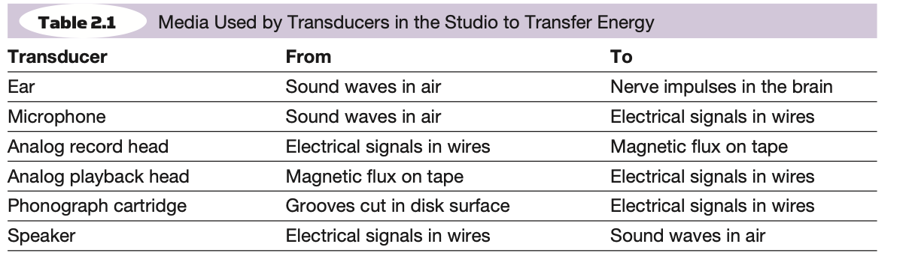
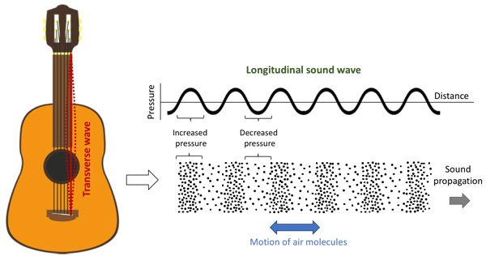
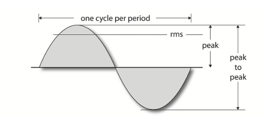
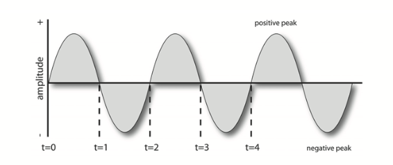
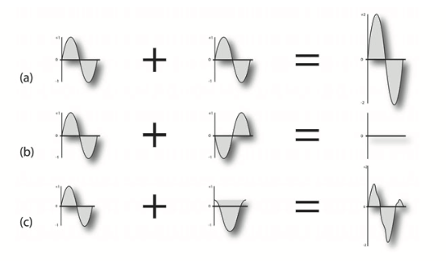
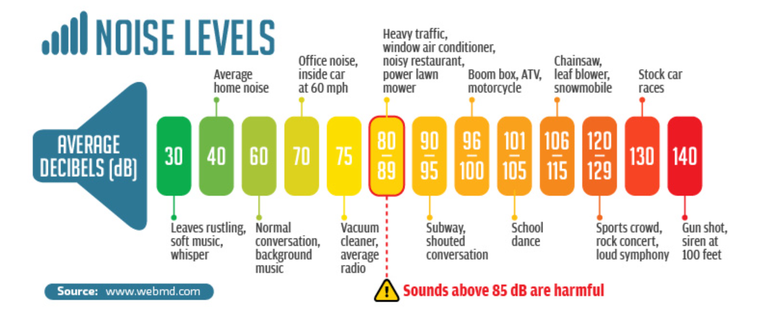

+++
title = "Sound and hearing"
outputs = ["Reveal"]
[reveal_hugo]
theme = "moon"
margin = 0.2
separator = "##"
+++

# Sound and hearing

{}
In order to understand the basics of audio production, we need to understand the basics of sound. Recording, sampling and synthesis all start and end with sound. 

{}

---

## Sound areas

* The basics of sound
* The characteristics of the ear
* How the ear is stimulated by sound 
*  The psychoacoustics of hearing

---

The Transducer

device -> energy conversion -> resulting energy

<a href="https://commons.wikimedia.org/wiki/File:Django_Reinhardt_(Gottlieb_07301).jpg">William P. Gottlieb</a>, Public domain, via Wikimedia Commons

{}
ex: 
guitar - vibrations -> amplified by wood -> converted into sound pressure waves that we percieve as sound

What types of devices could be considered transducers?

* microphone
* etc 
  
{}

---

---

# The basics of sound 

{}
Sound arrives at the ear in the form of periodic variations in atmospheric pressure called sound-pressure waves. This is the same atmospheric pressure that’s measured by the weather service; although, the changes in pressure heard by the ear are simply too small in magnitude and fluctuate too rapidly to be observed on a barometer.

It is sort of like when a ballon is popped

{}

---

{}
Any vibrating mass, such as the voice, or a guitar causes compression and rarefaction creating areas of high and low pressure states. These pressure states move the sound wave out from the source, allowing us to hear it. 

This is a helpful diagram but this is not usually how we visualize sound. We do it with a waveform, a graphic representation of sound-pressure level. Looking at the waveform we can tell if the sound is quiet or loud and sometimes the frequency of the sound.
{}

---

## Amplitude 

{}
The distance above or below the centerline of a waveform (such as a pure sine wave) represents the amplitude level of that signal. The greater the distance or displacement from that centerline, the more intense the pressure variation, electrical signal level or physical displacement will be within a medium.
{}

---

## Frequency 

{}
The rate at which an acoustic generator, electrical signal or vibrating mass repeats within a cycle of positive and negative amplitude is known as the frequency of that signal.

We can also measure a frequency in cycles per second; (Hz) or hertz (Hz). An "A" note is 440 Hz.
{}

---

## Phase

{}
For simplicity’s sake, let’s limit our example to two pure tone waveforms (sine waves) that have equal amplitudes and frequency, but start their cyclic periods at different times. Such waveforms are said to be out of phase with respect to each other.

Out of phase signals can cause reductions in amplitude and are generally undesirable. 

The example shows waves that either increase in amplitude, cancel altogether or combine. The last is more likely in practice. 

Everyone should try the DIY activity on page 55 in the book to hear this for themselves. 
{}

---

## Harmonic content

{}
Most real life sounds are much more complex than a sine wave. 

The factor that helps us differentiate between instrumental “voicings” is the presence of frequencies (called partials) that exist in addition to the fundamental pitch that’s being played. Partials that are higher than the fundamental frequency are called upper partials or overtones. If the overtones are whole-number multiples of the fundamental frequency, they are called harmonics.

Harmonics also form the basis of synthesis. 

Try the DIY on page 56 now. 
{}

---

# The Decibel 

{}
Loudness is variations in sound pressure level or SPL and is measured on a logarithmic scale in decibels (dB).
{}

---

# The Ear

Threshold of Hearing

---

Threshold of Feeling

---

Threshold of Pain

---

Taking Care of Your Hearing 

---

Psychoacoustics

---

Auditory Perception

---

Beats 

---

Combination Tones 

---

Masking 

---

Perception of Direction