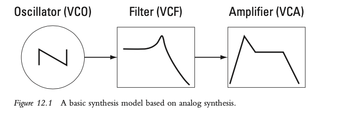
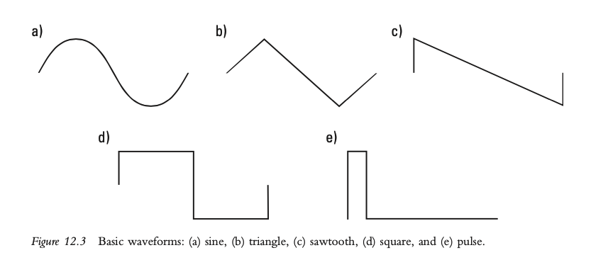
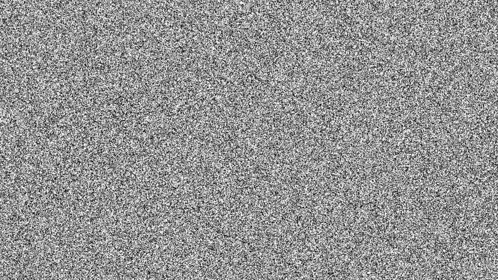
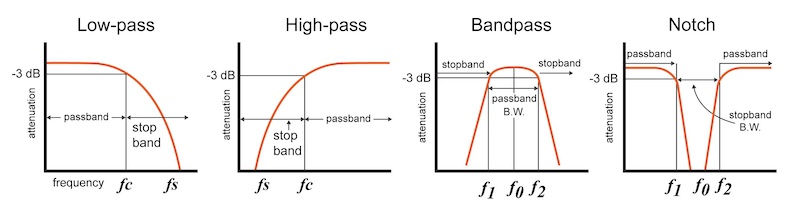
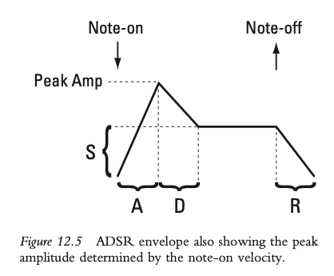
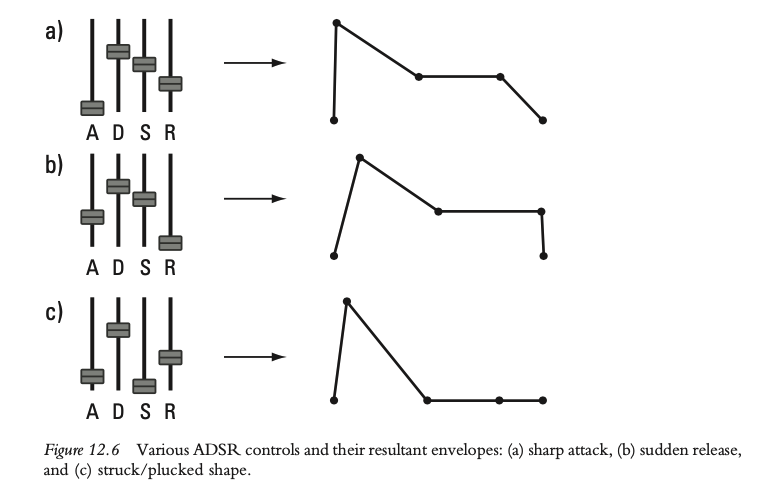

+++
title = "Electronic Sound Production"
outputs = ["Reveal"]
[reveal_hugo]
theme = "solarized"
# show_notes = "separate-page"
+++

# Electronic sound production - synthesis 

{}
We have learned some basics of electronic sound production with our discussion of MIDI editing, sequencing and sampling. Now we'll dive deeper into a very important method of sound production, synthesis. 

**Synthesis** refers to any method that generates sound “from the ground up” according to some recipe, or algorithm. For example, to re-create the sound of a trumpet using a synthesis method, you could use software that adds together simple sine waves whose frequencies, amplitudes, and phases match the partials that are present in a trumpet sound. This particular method is referred to as additive synthesis and will be discussed in more detail in the next chapter along with a variety of other synthesis methods.

---

## Basic synthesis model 

{}
We can think of these as three separate modules that have different purposes and can be combined to create a sound.

• The oscillator provides a basic waveform (timbre) at a particular frequency (pitch).
• The filter modifies the spectrum (timbre) of the basic waveform.
• The amplifier applies an envelope to the amplitude of the audio (loudness and
articulation).

In our DAWs we perform not actual analogue synthesis, but analogue modeling synthesis. 

The v stands for voltage control, which harkens back to when these modules were actually controlled by electrical voltage. 

---

# Pitch and timbre source: the oscillator 

[Learning Synths - Oscillators](https://learningsynths.ableton.com/en/oscillators/how-synths-make-sound)

---

## Basic Waveforms 

{}
Oscillator - generate a waveform at a particular frequency. They take one cycle of a waveform and repeat it at a rate determined by the MIDI key number.

This is called fixed waveform or wavetable synthesis. Used alone it is the most simple form of synthesis.

---

## Noise 

{}
An important source for timbre is noise. It is often used for percussive synthesis. When filtered it can also be used for wind sounds and rising effects in EDM. 

---

## Timbre modification: the filter 

[Learning Synths - Fitlers](https://learningsynths.ableton.com/en/filters/filters-in-the-real-world)

{}
We have already covered filters somewhat in our discussions on mixing. Here we called them equalization and they generally had a subtle effect on the sound. 

in sound synthesis filters have a much more drastic and noticeable effect. 

A very common filter in synthesis is the low pass filter. It creates the typical DJ sweep sound we all know and love..

The **cutoff frequency** of the filter determines where in the spectrum the partials start to be reduced in amplitude.

**Resonance** in a filter boosts the amplitude of the partials at the cutoff frequency. This has a certain timbral effect. 

---

# Loudness modification: the amplifier 

{}
The third part in our synthesis chain is the amplifier. Instead of just turning the oscillator on and off we shape it with an amplitude envelope. 

---

## Applying articulation with an envelope 

[Learning Synths - Envelopes](https://learningsynths.ableton.com/en/envelopes/change-over-time)

{}

In a synthesizer, an envelope generator allows the amplifier both to determine the maximum amplitude of the sound and to shape the amplitude over the course of a note. 

ADSR - attack time, decay time, sustain level, release time 

* attack - the time it takes for the amplitude to reach its maximum value.
* decay - the time it takes for the amplitude to reach its sustain level.
* sustain - the level of amplitude that the envelope will hold after the decay phase. 
    * this last as long as the note is held.
* release - after a note off message - the time it takes for the amplitude to reach its minimum value.

---

---

## Modulation:  Making the sound more dynamic

* **oscillator**: pitch and waveform;
* **filter**: filter type, cutoff frequency, and resonance;
* **amplifier**: overall level and attack-decay-sustain-release parameters.

{}
During our previous example the timbre of the synth with not change at all. This type of synthesis sounds very artificial to use because natural sound is changing all the time. 

To make our sounds more interesting we must have its parameters changing in some way all the time, which is called **modulation**.

The modulatable parameters of our model are this: 
• oscillator: pitch and waveform;
• filter: filter type, cutoff frequency, and resonance;
• amplifier: overall level and attack-decay-sustain-release parameters.

There are three basic ways to control these parameters: through **direct control**, with an **envelope**, and with a **low frequency oscillator (LFO)**.

Direct control refers to the parameters being controlled directly by MIDI messages or you actually turning knobs and sliders yourself on an analogue synthesizer.

---

<iframe width="560" height="315" src="https://www.youtube.com/embed/wul-rUHyX_E" title="YouTube video player" frameborder="0" allow="accelerometer; autoplay; clipboard-write; encrypted-media; gyroscope; picture-in-picture" allowfullscreen></iframe>

---

## Modulation with LFOs

[Learning Synths - LFOs](https://learningsynths.ableton.com/en/lfos/lfos-in-the-real-world)

{}